# 📍 SiteSync — Geo-Fenced Workforce Management Platform

<p align="center">
  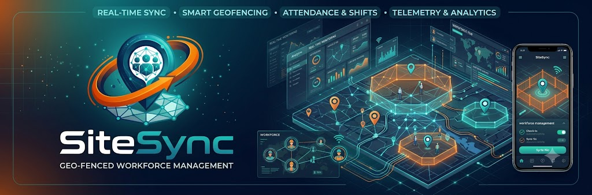
</p>

<p align="center">
  <b>A full-stack workforce management platform for location-aware attendance, custom polygon geofencing, and real-time worker tracking.</b>
</p>

<p align="center">
  
  
  
  
  
</p>

---

## 📖 Table of Contents

- [Overview](#-overview)
- [Problem](#-problem)
- [Solution](#-solution)
- [Key Features](#-key-features)
- [Complete Workflow](#-complete-workflow)
- [System Architecture](#-system-architecture)
- [Manager Web Dashboard](#-manager-web-dashboard)
- [Live Tracking Dashboard](#-live-tracking-dashboard)
- [Worker Mobile Application](#-worker-mobile-application)
- [Geofencing System](#-geofencing-system)
- [Authentication & Authorization](#-authentication--authorization)
- [Session Management](#-session-management)
- [Real-Time Location Tracking](#-real-time-location-tracking)
- [REST API](#-rest-api)
- [Database Design](#-database-design)
- [Technology Stack](#-technology-stack)
- [Project Structure](#-project-structure)
- [Installation](#-installation)
- [Environment Variables](#-environment-variables)
- [Running the Application](#-running-the-application)
- [Mobile Application Setup](#-mobile-application-setup)
- [Screenshots](#-screenshots)
- [Project Status](#-project-status)
- [Future Improvements](#-future-improvements)
- [What This Project Demonstrates](#-what-this-project-demonstrates)
- [Author](#-author)

  # 🚀 Overview

**SiteSync** is a full-stack geo-fenced workforce management platform designed to manage workers, work sites, attendance sessions, and real-time worker locations.

The platform consists of:

- A **React-based manager web dashboard**
- A **React Native + Expo worker mobile application**
- A **Node.js + Express backend**
- A **MongoDB database**
- **Socket.IO** for real-time location updates
- **Leaflet + Leaflet Draw** for interactive geofence creation
- **Turf.js** for polygon processing and geospatial calculations

SiteSync verifies a worker's GPS location on the server before allowing clock-in and continuously records location updates during an active work session.

# 🎯 Problem

Traditional attendance systems may not verify whether an employee is physically present at the designated work location.

For location-dependent workforces, managers may need to:

- Define actual work areas
- Assign workers to specific sites
- Verify worker location before attendance
- Track active workers
- Maintain attendance/session history
- Monitor workers in real time

  # 💡 Solution

SiteSync combines **mobile GPS**, **custom polygon geofencing**, **server-side geospatial validation**, and **real-time communication** into one workforce management system.

A typical flow is:

```text
Manager Creates Work Site
          ↓
Manager Draws Geofence Polygon
          ↓
Worker Is Assigned to Site
          ↓
Worker Opens Mobile App
          ↓
Worker Requests Clock-In
          ↓
Mobile App Sends GPS Coordinates
          ↓
Backend Verifies Geofence
          ↓
Clock-In Session Created
          ↓
Location Updates Every 30 Seconds
          ↓
Socket.IO Broadcasts Location
          ↓
Manager Views Worker on Live Map
          ↓
Worker Clocks Out
          ↓
Session Completed and Stored
```

---

# ✨ Key Features

### 👨‍💼 Manager Dashboard

- Manager authentication
- Dashboard overview
- Worker management
- Worker creation and editing
- Worker deletion
- Work-site management
- Create, edit, and delete sites
- Custom polygon geofence drawing
- Automatic geofence area calculation
- Worker-site assignment
- Live worker tracking
- Session history

### 👷 Worker Mobile Application

- Worker authentication
- Assigned-site listing
- GPS location detection
- Location permission handling
- Server-side geofence verification
- Clock-in
- Active session tracking
- Periodic location updates
- GPS accuracy display
- Clock-out
- Active session restoration

### 🌍 Geospatial Features

- Custom polygon geofences
- GeoJSON Polygon storage
- GeoJSON Point generation
- Turf.js polygon processing
- Polygon self-intersection validation
- Centroid calculation
- Approximate area calculation
- MongoDB `2dsphere` geospatial indexing
- MongoDB `$geoIntersects` verification

### 📡 Real-Time Features

- Socket.IO communication
- Site-based Socket.IO rooms
- Worker location broadcasting
- Live marker updates
- 30-second location ping interval

---

# 🔄 Complete Workflow

## 👨‍💼 Manager Workflow

```text
Manager Login
     ↓
Manager Dashboard
     ↓
Create Work Site
     ↓
Draw Custom Polygon
     ↓
Geofence Validation
     ↓
Save Site
     ↓
Create Worker
     ↓
Assign Worker to Site
     ↓
Monitor Active Workers
     ↓
View Live Tracking
```

## 👷 Worker Workflow

```text
Worker Login
     ↓
View Assigned Sites
     ↓
Select Site
     ↓
Request GPS Permission
     ↓
Get Current Location
     ↓
Send Coordinates to Backend
     ↓
Server-side Geofence Verification
     ↓
Clock-In
     ↓
Active Session
     ↓
Location Ping Every 30 Seconds
     ↓
Clock-Out
     ↓
Completed Session
```
# 🏗️ System Architecture

```text
                         ┌──────────────────────┐
                         │   Manager Web App    │
                         │       React          │
                         └──────────┬───────────┘
                                    │
                                    │ REST API
                                    ▼
┌──────────────────────┐     ┌──────────────────────┐
│   Worker Mobile App  │────►│   Node / Express     │
│ React Native + Expo  │     │      Backend         │
└──────────────────────┘     └──────────┬───────────┘
             │                           │
             │ GPS                       │
             │                           ├──────────────► MongoDB
             │                           │
             │                           └──────────────► Socket.IO
             │                                             │
             │                                             ▼
             │                                    Manager Live Tracking
             │
             └─────────────── Location Updates ────────────┘
```

---

# 🖥️ Manager Web Dashboard

The manager dashboard provides interfaces for authentication, site management, worker management, assignments, and live tracking.

## 🔐 01 — Manager Login

Managers authenticate before accessing the workforce management dashboard.

<p align="center">
  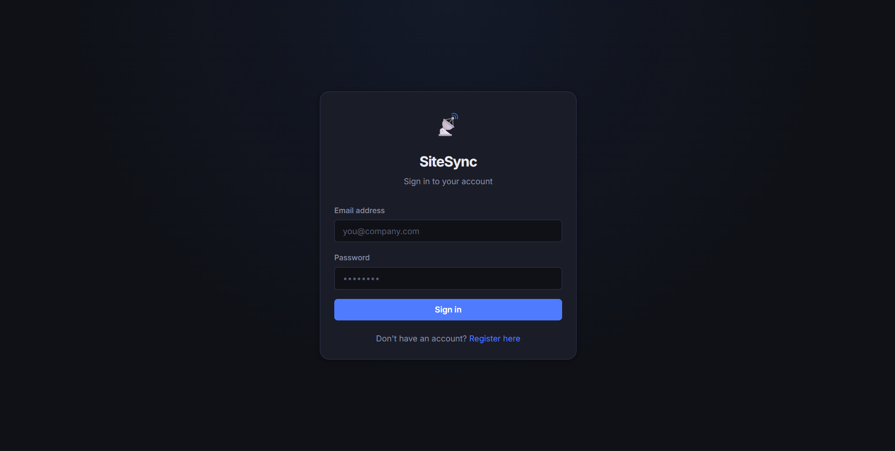
</p>

---

## 📊 02 — Manager Dashboard

The dashboard provides an overview of workforce activity and managed sites.

<p align="center">
  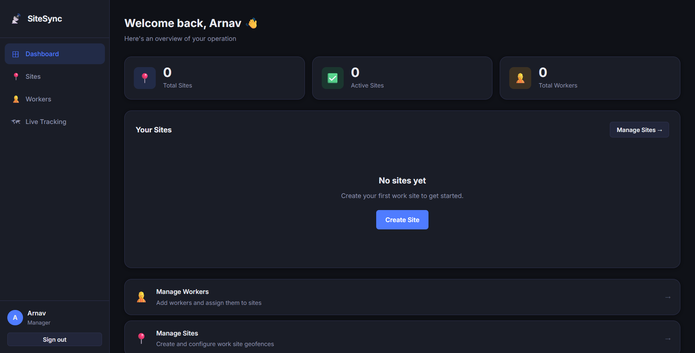
</p>

---

## 📍 03 — Site Management

Managers can create and manage work sites from the Sites interface.

<p align="center">
  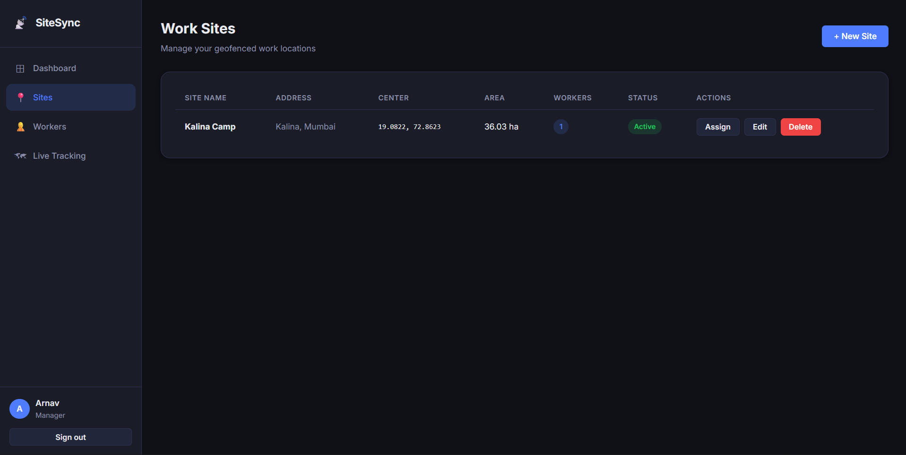
</p>

---

## 🗺️ 04 — Create Geofenced Site

Managers can draw a custom polygon directly on the map to define the work area.

<p align="center">
  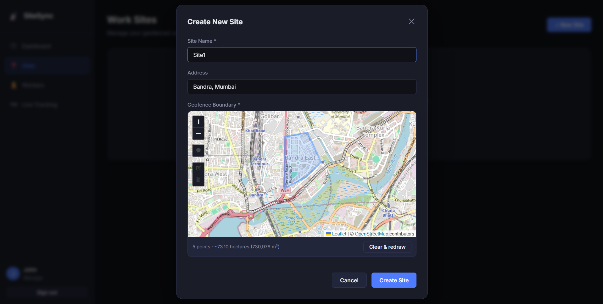
</p>

The geofence processing includes:

- Polygon validation
- Ring closure
- Self-intersection checking
- Centroid calculation
- Approximate area calculation
- GeoJSON Polygon generation

---

## 👥 05 — Worker Management

Managers can create, update, and remove worker accounts.

<p align="center">
  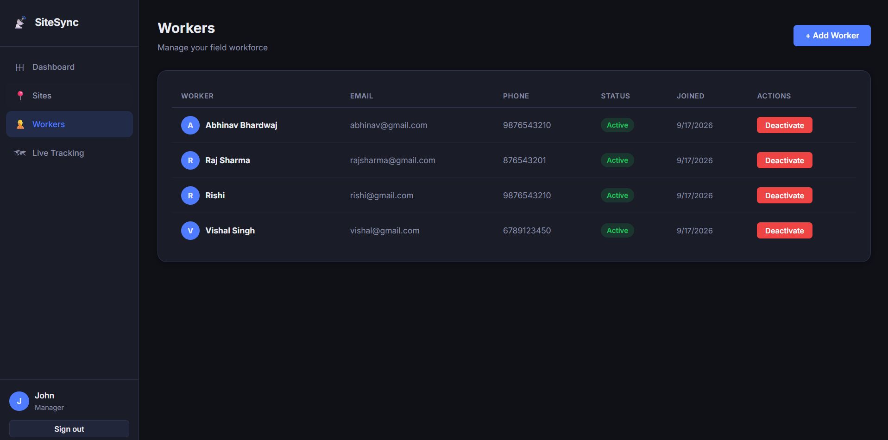
</p>

---

## ➕ 06 — Add Worker

Managers can create worker accounts that can later be assigned to work sites.

<p align="center">
  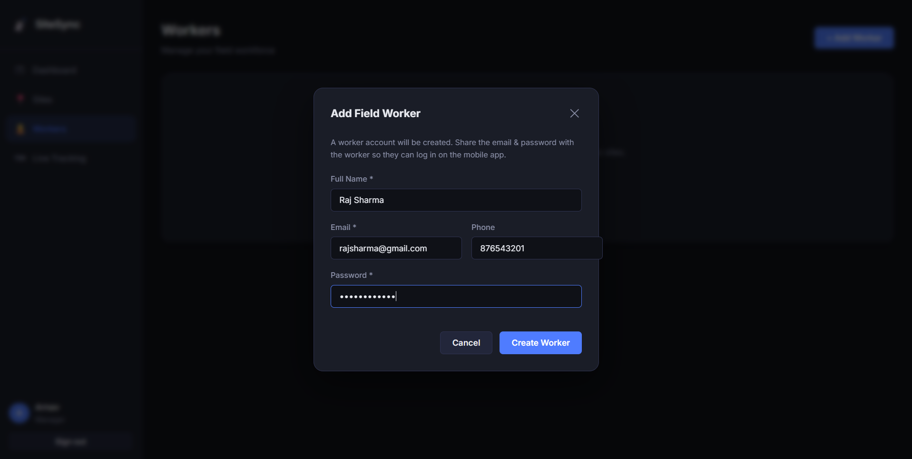
</p>

---

## 🔗 07 — Assign Worker to Site

Managers can assign workers to specific work sites.

<p align="center">
  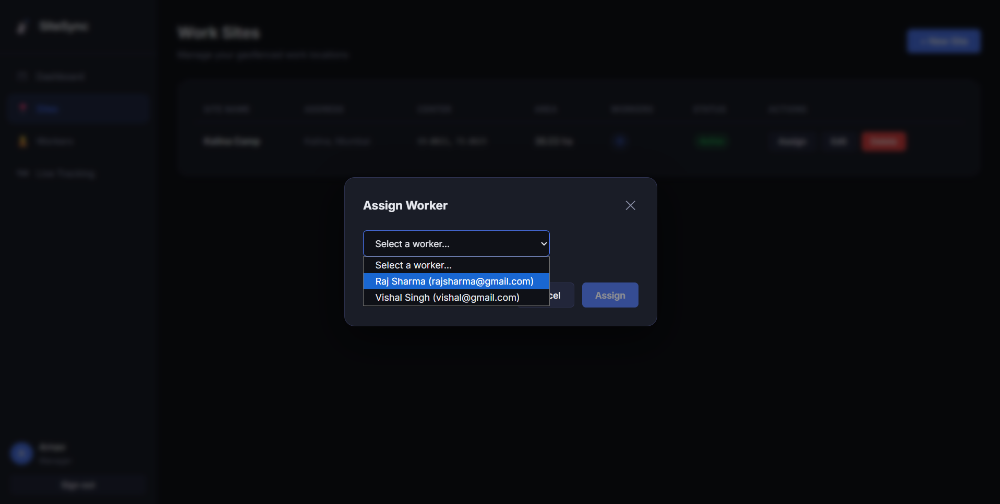
</p>

# 🗺️ Live Tracking Dashboard

SiteSync includes a dedicated **Live Tracking** interface for managers.

Managers can select a work site and view workers who currently have active sessions.

The map displays:

- Work-site geofence
- Active worker locations
- Worker names
- Current location updates

<p align="center">
  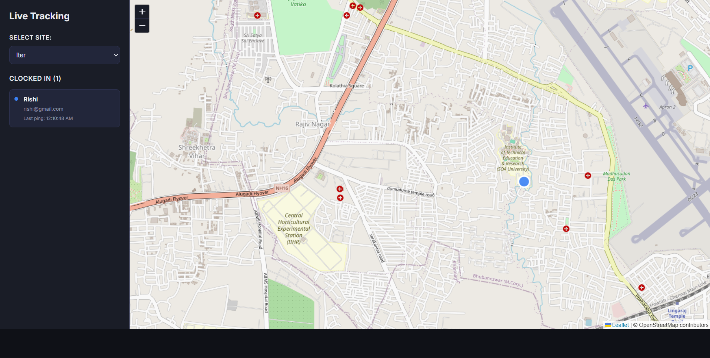
</p>

---

## 📡 Real-Time Location Flow

The worker's phone sends a location update every **30 seconds** while an active session is running.

```text
Worker Phone
     │
     │ GPS
     ▼
Current Coordinates
     │
     ▼
POST /api/sessions/location
     │
     ▼
Express Backend
     │
     ├──────────────► MongoDB
     │                 Location Log
     │
     ▼
Socket.IO Event
     │
     ▼
site-{siteId} Room
     │
     ▼
Manager Dashboard
     │
     ▼
Worker Marker Updated
```

---

# 📱 Worker Mobile Application

The worker application is built using:

- React Native
- Expo
- React Navigation
- Expo Location
- Expo Secure Store
- Axios

---

## 🔐 01 — Worker Login

Workers log into the mobile application using credentials created by their manager.

<p align="center">
  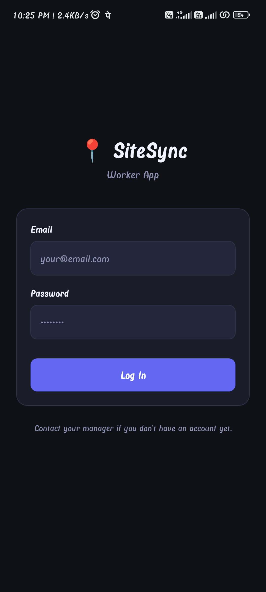
</p>

---

## 📍 02 — Assigned Sites

After authentication, workers can see the sites assigned to them.

Each site can display:

- Site name
- Address
- Geofenced area

<p align="center">
  
</p>

---

## 🛰️ 03 — GPS Verification

When the worker chooses a site and starts the clock-in process:

```text
Request Location Permission
          ↓
Get Current GPS Position
          ↓
Read Latitude / Longitude
          ↓
Send Coordinates to Backend
          ↓
Server-side Geofence Check
```

<p align="center">
  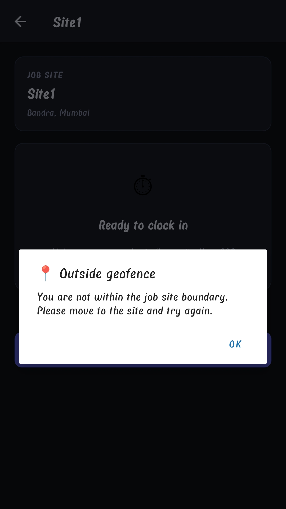
</p>

## 🟢 04 — Clock In

The worker can clock in only after the backend verifies their location.

The server checks:

```text
1. Worker is authenticated
2. Worker has no active session
3. Worker is assigned to the site
4. GPS point is inside the geofence
```

If all checks pass, an active session is created.

<p align="center">
  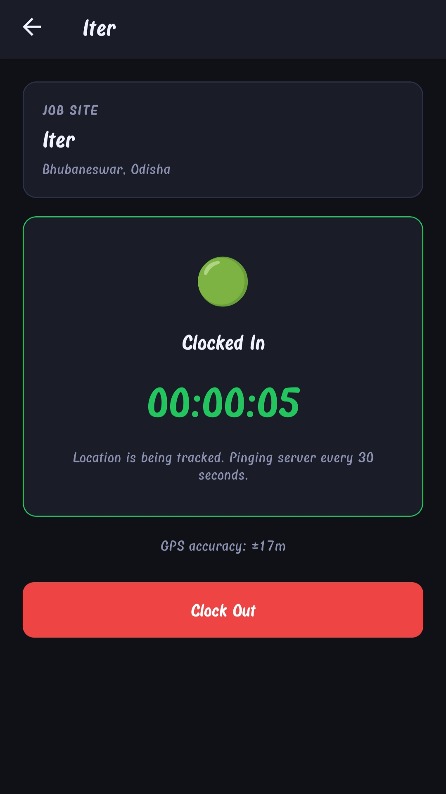
</p>

---

# ⏱️ Active Work Session

After successful clock-in, the application enters an active state.

The mobile application:

- Displays the elapsed session time
- Shows GPS accuracy
- Sends periodic location updates
- Allows the worker to clock out

<p align="center">
  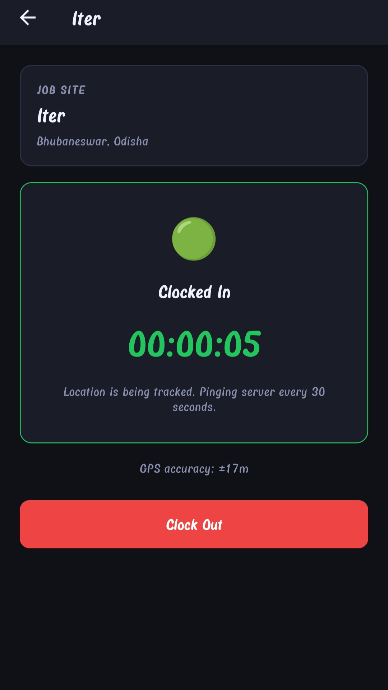
</p>

---

# 📡 Location Pings

The current implementation sends a location ping approximately every **30 seconds** while the worker is clocked in.

```javascript
const PING_INTERVAL_MS = 30_000;
```

Each location update contains:

```text
longitude
latitude
accuracy
```

These coordinates are stored as GeoJSON Points in the worker's session.

---

# 🔴 Clock Out

When the worker finishes their work session, they can clock out.

The backend calculates the session duration:

```text
Clock Out Time
      -
Clock In Time
      =
Duration
```

The completed session is stored in MongoDB.

<p align="center">
  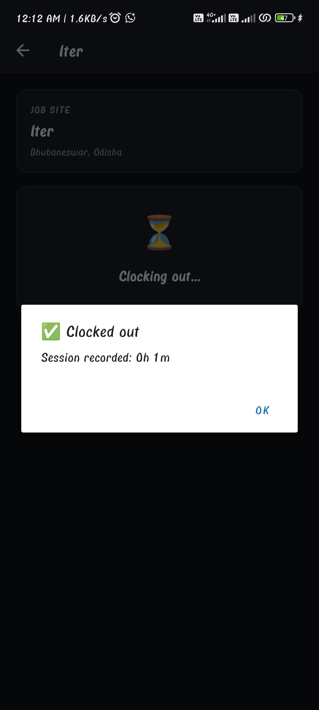
</p>

# 🔄 Active Session Restoration

If a worker closes the application while clocked in, the application can query:

```http
GET /api/sessions/active
```

and restore the active session state.

This prevents the application from losing track of an ongoing work session simply because the mobile interface was closed.

---

# 🧠 Geofencing System

Geofencing is one of the central features of SiteSync.

Instead of storing only a point and radius, SiteSync allows the manager to draw a **custom polygon** representing the actual work area.

---

## 1. Manager Draws Polygon

```text
Leaflet Map
     ↓
Polygon Drawing Tool
     ↓
Latitude / Longitude Points
```

---

## 2. Turf.js Processes the Polygon

The backend:

- Ensures there are enough points
- Closes the polygon ring
- Creates a GeoJSON polygon
- Checks for self-intersections
- Calculates the centroid
- Calculates the approximate area

---

## 3. Polygon Stored in MongoDB

The site stores the geofence using GeoJSON:

```json
{
  "type": "Polygon",
  "coordinates": [
    [
      [longitude, latitude],
      [longitude, latitude],
      [longitude, latitude],
      [longitude, latitude]
    ]
  ]
}
```

---

## 4. Worker Sends GPS Coordinates

The worker application sends:

```json
{
  "siteId": "...",
  "longitude": "...",
  "latitude": "...",
  "accuracy": "..."
}
```

---

## 5. MongoDB Performs Geospatial Verification

The backend creates a GeoJSON point and checks it against the stored polygon:

```text
Worker GPS
    ↓
GeoJSON Point
    ↓
MongoDB $geoIntersects
    ↓
Site Geofence Polygon
```

If the point is inside the polygon:

```text
✅ Clock-in allowed
```

Otherwise:

```text
❌ Clock-in rejected
```

# 🔐 Authentication & Authorization

SiteSync uses JWT-based authentication with role-based access control.

## Authentication Flow

```text
Login Credentials
       ↓
Express Authentication Route
       ↓
Password Verification
       ↓
JWT Token Generated
       ↓
Token Stored by Client
       ↓
Authenticated API Requests
```

Passwords are hashed using **bcryptjs** before storage.

The backend distinguishes between:

- `manager`
- `worker`

Protected routes verify the JWT and enforce role-specific access.

---

# ⏱️ Session Management

SiteSync manages the complete worker attendance lifecycle:

```text
Idle
  ↓
Location Verification
  ↓
Clock-In
  ↓
Active Session
  ↓
Periodic Location Updates
  ↓
Clock-Out
  ↓
Completed Session
```

Session records can contain:

- Worker
- Site
- Clock-in time
- Clock-out time
- Duration
- Location information
- Session status

---

# 📡 Real-Time Location Tracking

During an active session:

```text
Worker Mobile App
       │
       │ Every 30 Seconds
       ▼
GPS Coordinates
       │
       ▼
POST /api/sessions/location
       │
       ▼
Express Backend
       │
       ├────────────► MongoDB
       │
       ▼
Socket.IO
       │
       ▼
Site-specific Room
       │
       ▼
Manager Live Tracking
```

This allows the manager dashboard to update worker markers without requiring a manual page refresh.

# 🔌 REST API

## Authentication

| Method | Endpoint | Description |
|---|---|---|
| POST | `/api/auth/register` | Register account |
| POST | `/api/auth/login` | Authenticate user |
| GET | `/api/auth/me` | Get authenticated user |

## Workers / Users

| Method | Endpoint | Description |
|---|---|---|
| GET | `/api/users` | Get users |
| GET | `/api/users?role=worker` | Get workers |
| POST | `/api/users/workers` | Create worker |
| PUT | `/api/users/workers/:id` | Update worker |
| DELETE | `/api/users/workers/:id` | Delete worker |

## Sites

| Method | Endpoint | Description |
|---|---|---|
| GET | `/api/sites` | Get sites |
| GET | `/api/sites/:id` | Get site |
| POST | `/api/sites` | Create site |
| PUT | `/api/sites/:id` | Update site |
| DELETE | `/api/sites/:id` | Delete site |
| POST | `/api/sites/:id/assign` | Assign worker |
| DELETE | `/api/sites/:id/assign/:workerId` | Remove worker assignment |

## Sessions

| Method | Endpoint | Description |
|---|---|---|
| POST | `/api/sessions/clock-in` | Clock in |
| POST | `/api/sessions/location` | Submit location update |
| POST | `/api/sessions/clock-out` | Clock out |
| GET | `/api/sessions/active` | Get active session |
| GET | `/api/sessions/my` | Get worker sessions |
| GET | `/api/sessions/site/:siteId` | Get site sessions |
| GET | `/api/sites/:id/sessions` | Get sessions for site |

## Health Check

```http
GET /api/health
```

Response:

```json
{
  "status": "ok"
}
```

---

# 🗄️ Database Design

SiteSync uses **MongoDB** with **Mongoose**.

The primary data models are:

```text
User
 │
 ├── Manager
 └── Worker
       │
       ▼
     Session
       │
       ▼
      Site
       │
       ▼
Geofence Polygon
```

## User

Stores authentication and role information for managers and workers.

## Site

Stores:

- Site name
- Address
- Geofence
- GeoJSON geometry
- Assigned workers
- Site metadata

## Session

Stores:

- Worker reference
- Site reference
- Clock-in time
- Clock-out time
- Duration
- Location information
- Session status

Geospatial fields use MongoDB geospatial indexing where required.

# 🛠️ Technology Stack

| Category | Technologies |
|---|---|
| Web Frontend | React, React Router |
| Mobile | React Native, Expo |
| Maps | Leaflet, Leaflet Draw, OpenStreetMap |
| Geospatial Processing | Turf.js |
| Backend | Node.js, Express.js |
| Database | MongoDB, Mongoose |
| Authentication | JWT, bcryptjs |
| Validation | express-validator |
| Real-Time | Socket.IO |
| HTTP Client | Axios |
| Mobile Storage | Expo Secure Store |
| Location | Expo Location |
| Development | Git, GitHub |

---

# 📁 Project Structure

```text
SiteSync/
│
├── client/
│   ├── src/
│   │   ├── components/
│   │   ├── context/
│   │   ├── pages/
│   │   └── ...
│   └── package.json
│
├── mobile/
│   ├── src/
│   │   ├── screens/
│   │   ├── navigation/
│   │   ├── context/
│   │   └── utils/
│   └── package.json
│
├── server/
│   ├── models/
│   │   ├── User.js
│   │   ├── Site.js
│   │   └── Session.js
│   │
│   ├── routes/
│   │   ├── auth.js
│   │   ├── users.js
│   │   ├── sites.js
│   │   └── sessions.js
│   │
│   ├── middleware/
│   │   └── auth.js
│   │
│   └── ...
│
├── screenshots/
│   ├── banner.png
│   ├── web/
│   └── mobile/
│
├── package.json
├── package-lock.json
├── .gitignore
└── README.md
```
# ⚙️ Installation

Clone the repository:

```bash
git clone https://github.com/AbhinavBZ/SiteSync.git
cd SiteSync
```

Install dependencies:

```bash
npm run install-all
```

---

# 🔑 Environment Variables

Create a `.env` file inside the `server` directory:

```env
MONGO_URI=your_mongodb_atlas_connection_string
JWT_SECRET=your_secret_key
CLIENT_URL=http://localhost:3000
PORT=5000
```

> **Note:** Do not commit your `.env` file or expose your database credentials and JWT secret.

---

# ▶️ Running the Application

Start the web client and backend using:

```bash
npm run dev
```

Web application:

```text
http://localhost:3000
```

Backend:

```text
http://localhost:5000
```

# 📱 Mobile Application Setup

Start the Expo development server:

```bash
npm run mobile
```

Alternatively:

```bash
cd mobile
npx expo start
```

For physical-device testing, configure the mobile API URL to point to your development machine's local network IP address.

Example:

```text
http://192.168.x.x:5000
```

Make sure the mobile device and development machine can communicate over the same network.

---

# 🖼️ Screenshots

## Manager Web Application

### 🔐 Login

<p align="center">
  
</p>

### 📊 Dashboard

<p align="center">
  
</p>

### 📍 Site Management

<p align="center">
  
</p>

### 🗺️ Geofence Creation

<p align="center">
  
</p>

### 👥 Worker Management

<p align="center">
  
</p>

### ➕ Add Worker

<p align="center">
  
</p>

### 🔗 Worker Assignment

<p align="center">
  
</p>

### 🗺️ Live Tracking

<p align="center">
  
</p>

---

## 📱 Worker Mobile Application

### 🔐 Login

<p align="center">
  
</p>

### 📍 Assigned Sites

<p align="center">
  
</p>

### 🛰️ GPS Verification

<p align="center">
  
</p>

### 🟢 Clock In

<p align="center">
  
</p>

### ⏱️ Active Session

<p align="center">
  
</p>

### 🔴 Clock Out

<p align="center">
  
</p>

# ✅ Project Status

| Feature | Status |
|---|:---:|
| Manager Authentication | ✅ |
| Worker Authentication | ✅ |
| JWT Authentication | ✅ |
| Password Hashing | ✅ |
| Role-Based Authorization | ✅ |
| Manager Dashboard | ✅ |
| Site Creation / Editing / Deletion | ✅ |
| Polygon Geofence Drawing | ✅ |
| Geofence Validation | ✅ |
| Geofence Area Calculation | ✅ |
| Worker Management | ✅ |
| Worker-Site Assignment | ✅ |
| GPS Detection | ✅ |
| Server-Side Geofence Verification | ✅ |
| Clock-In | ✅ |
| Active Session | ✅ |
| Clock-Out | ✅ |
| GPS Location Logging | ✅ |
| 30-Second Location Pings | ✅ |
| Socket.IO Location Broadcasting | ✅ |
| Manager Live Tracking | ✅ |
| MongoDB Atlas Integration | ✅ |
| Active Session Restoration | ✅ |

---

# 🔮 Future Improvements

Potential future improvements include:

- Advanced attendance analytics
- Automated timesheet reports
- CSV / PDF report generation
- Push notifications
- Workforce analytics
- Location history visualization
- Attendance summaries
- Production deployment
- Additional security hardening
- Production mobile builds

---

# 🧠 What This Project Demonstrates

SiteSync demonstrates practical experience with:

- Full-stack application architecture
- React frontend development
- React Native mobile development
- REST API development
- JWT authentication
- Role-based access control
- MongoDB data modeling
- Geospatial databases
- GeoJSON
- Polygon geofencing
- Turf.js geospatial processing
- GPS-based validation
- Socket.IO real-time communication
- Mobile location services
- State management
- API integration
- Multi-client application design

The project combines **web development, mobile development, backend engineering, databases, geospatial computing, and real-time systems** into a single application.

---

# 👨‍💻 Author

**Abhinav Bhardwaj**

B.Tech — Computer Science Engineering

Interested in:

- Full-Stack Development
- React
- Node.js
- AI/ML
- Generative AI

<p align="center">
  <a href="https://github.com/AbhinavBZ">
    
  </a>
</p>

---

<p align="center">
  ⭐ If you find this project useful, consider giving it a star.
</p>
